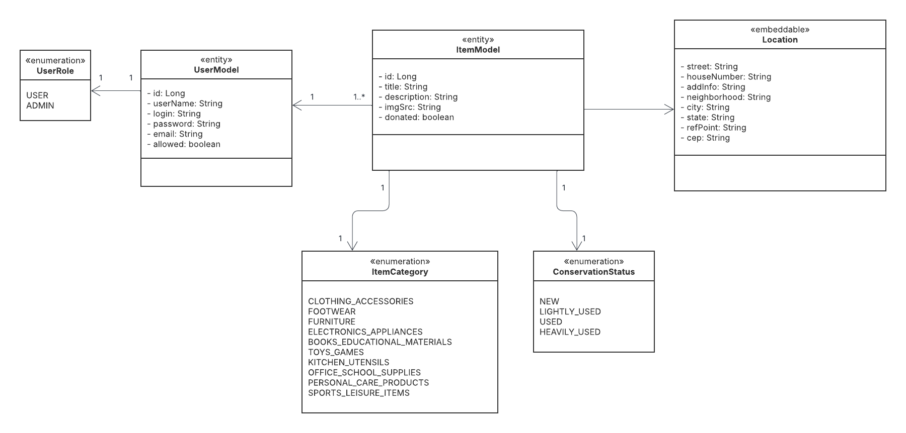
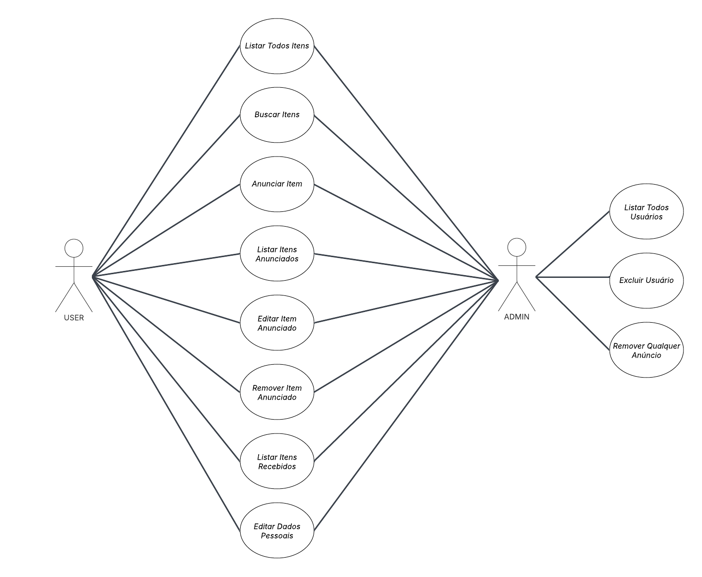

# Doe_Facil
Repositório voltado para o desenvolvimento do sistema web que será avaliado na disciplina Projeto Integrado


## 🛠️ Ferramentas Utilizadas

- **Git / GitHub**: Controle de versionamento e hospedagem do código-fonte.
- **Maven**: Gerenciador de dependências e ferramenta de build para o backend Java.
- **npm**: Gerenciador de pacotes e ferramenta de build para o frontend JavaScript.
- **Docker**: Plataforma para criação, execução e gerenciamento de contêineres, facilitando a inicialização e o empacotamento da aplicação.


# Repositório de Dockerfiles de desenvolvimento

Este tutorial ensina como configurar seu ambiente de desenvolvimento do Doe Fácil utilizando Docker. 

**Passo 1:** Tenha o Docker instalado em sua máquina

**Passo 2:** abra um terminal, vá para o diretório /docker e execute o seguinte comando:

```
docker compose up -d
```

Esse comando vai buildar as imagens e criar todo ambiente de desenvolvimento. Isso pode levar algum tempo uma vez que será efetuado o download de uma série de imagens e todas as depedências do sistema.

**Importante**: o build da imagem do `doefacil-backfront` pode levar algum tempo (+15min)


Quando tudo finalizar, se tudo deu certo, você deve ter 3 containers rodando na sua máquina. Ao executar o comando `docker ps` você deve encontrar os seguintes containers:

```
IMAGE             PORTS                                                                                      NAMES
phpmyadmin        0.0.0.0:8888->80/tcp, :::8888->80/tcp                                                  doefacil-phpmyadmin
mysql             0.0.0.0:3306->3306/tcp, :::3306->3306/tcp, 33060/tcp                                   doefacil-mysql
java_node         0.0.0.0:4200->4200/tcp, :::4200->4200/tcp, 0.0.0.0:8080->8080/tcp, :::8080->8080/tcp   doefacil-backfront
```

Se esses containers não estiverem ativos, algum problema ocorreu durante a construção das imagens. Tente fazer novamente. Se não conseguir, procure ajuda.

Breve descrição de cada container:
- `doefacil-mysql`: container com a imagem do banco MySQL. 
- `doefacil-phpmyadmin`: container com a imagem do PHPMyAdmin. Ele já se conecta com o banco de dados automaticamente.
- `doefacil-backfront`: este é o container de desenvolvimento do Doe Fácil. Veja a próxima seção para mais instruções de como usar.

## Utilizando o PHPMyAdmin

O PHPMyAdmin pode ser acessado na sua máquina utilizando o endereço `localhost:8888`. O login padrão é `root` e a senha padrão também é `root`.

Nele você vai encontrar o banco de dados de nome doefacil. Você pode realizar consultas, remoção, adicionar dados, etc. Para um tutorial de como usar o PHPMyAdmin [assista este vídeo](https://www.youtube.com/watch?v=kviT7G14gqk).


## Utilizando o container de desenvolvimento

O container `doefacil-backfront` contém tudo que é necessário para executar o front e o backend. A ideia é que você acesse-o com o comando:

```
docker exec -ti doefacil-backfront /bin/bash
```

Feito isso, você ganha acesso a um terminal que está rodando dentro do container. O diretório de trabalho principal é `/app` e ele é mapeado através de um volume com os diretórios da sua máquina. Com isso, você pode:

- Servir apenas o frontend:
  - Primeiro, vamos instalar as dependências do projeto. Entre no diretório `/app/doefacil-frontend/` e execute o comando `npm install`
    - Como você já deve saber, esse comando vai instalar as dependências do Angular. Tudo vai ser baixado dentro da pasta `node_modules`. Como a pasta está mapeada no volume do docker-compose, você precisa fazer isso uma única vez (será refeito apenas se você atualizar alguma dependência). Essa pasta **não deve ser versionada**, por isso ela está mapeada no `.gitignore`.
  - Uma vez baixadas as dependências, ainda dentro do diretório `/app/doefacil-frontend/`, execute o comando `ng serve --host 0.0.0.0`. Se tudo deu certo, você acessa o frontend na sua máquina no endereço `localhost:4200`

- Executar o backend
  - Agora abra o diretório `/app/doefacil-backend/` e execute o comando `mvn spring-boot:run`. Esse comando vai servir o backend no endereço `localhost:8080`
  - Além disso, é necessário que seja seja criado o arquivo application.properties. Ele é importante para fazer a conexão com o banco de dados informando os dados necessários. Crie um diretório chamado resources em `/app/doefacil-backend/src/main/`. Dentro desse novo diretório crie o arquivo `application.properties`.


## Diagrama de Classes




## Diagrama de Casos de Uso

