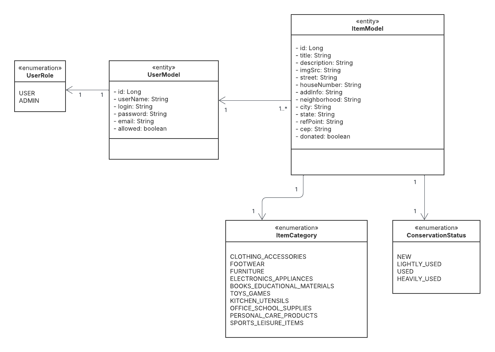
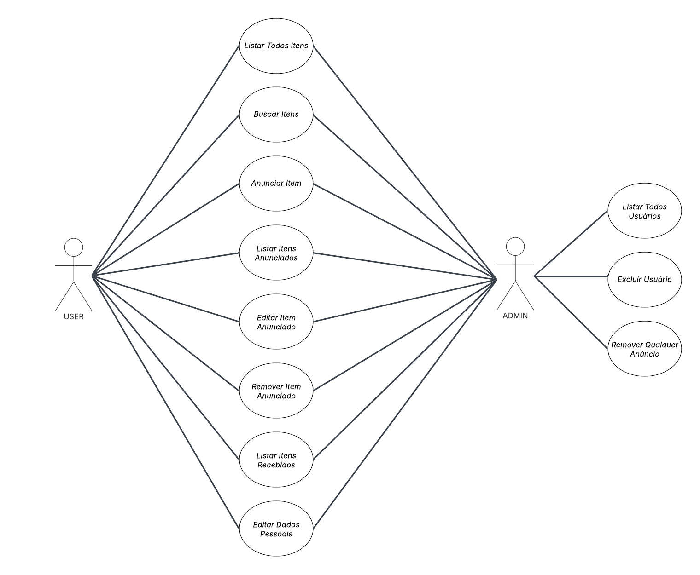

# Doe_Facil
Repositório voltado para o desenvolvimento do sistema web que será avaliado na disciplina Projeto Integrado


## Ferramentas Utilizadas

- **Git / GitHub**: Controle de versionamento e hospedagem do código-fonte.
- **Maven**: Gerenciador de dependências e ferramenta de build para o backend Java.
- **npm**: Gerenciador de pacotes e ferramenta de build para o frontend JavaScript.
- **Docker**: Plataforma para criação, execução e gerenciamento de contêineres, facilitando a inicialização e o empacotamento da aplicação.

## Frameworks Reutilizados

- **Angular 18**: Framework frontend para criação de interfaces dinâmicas e componentes reutilizáveis em aplicações single-page (SPA).
- **CoreUI**: Biblioteca de componentes visuais compatível com Angular, utilizada para acelerar o desenvolvimento da interface.
- **Spring Boot**: Framework Java que simplifica a criação de aplicações backend robustas, com configuração mínima.
- **Spring Data JPA**: Abstração sobre o JPA que facilita a integração com bancos de dados relacionais, eliminando a necessidade de escrever queries SQL na maior parte dos casos.
- **Spring Web**: Módulo do Spring Boot que fornece os recursos necessários para desenvolver APIs RESTful.
- **Spring Security**: Solução completa de segurança para autenticação e autorização em aplicações Java.
- **Java JWT**: Biblioteca usada para gerar, assinar e validar tokens JWT (JSON Web Token), garantindo a segurança nas requisições autenticadas.


## Como executar o sistema

Este tutorial ensina como executar a aplicação do Doe Fácil utilizando Docker. 

**Passo 1:** Tenha o Docker instalado em sua máquina

**Passo 2:** abra um terminal, vá para o diretório /docker e execute o seguinte comando:

```
docker compose up -d
```

Esse comando vai buildar as imagens e criar todo ambiente da aplicação. Isso pode levar algum tempo uma vez que será efetuado o download de uma série de imagens e todas as depedências do sistema.

Quando tudo finalizar, se tudo deu certo, você deve ter 3 containers rodando na sua máquina. Ao executar o comando `docker ps` você deve encontrar os seguintes containers:

```
IMAGE             PORTS                                                                                      NAMES
phpmyadmin        0.0.0.0:8888->80/tcp, :::8888->80/tcp                                                  doefacil-phpmyadmin
mysql             0.0.0.0:3306->3306/tcp, :::3306->3306/tcp, 33060/tcp                                   doefacil-mysql
doefacil         0.0.0.0:4200->4200/tcp, :::4200->4200/tcp, 0.0.0.0:8080->8080/tcp, :::8080->8080/tcp   doefacil-backfront
```

Se esses containers não estiverem ativos, algum problema ocorreu durante a construção das imagens. Tente fazer novamente. Se não conseguir, contate um dos desenvolvedores.

Breve descrição de cada container:
- `doefacil-mysql`: container com a imagem do banco MySQL. 
- `doefacil-phpmyadmin`: container com a imagem do PHPMyAdmin. Ele já se conecta com o banco de dados automaticamente.
- `doefacil-backfront`: este é o container de desenvolvimento do Doe Fácil. Veja a próxima seção para mais instruções de como usar.

### Utilizando o PHPMyAdmin

O PHPMyAdmin pode ser acessado na sua máquina utilizando o endereço `localhost:8888`. O login padrão é `root` e a senha padrão também é `root`.

Nele você vai encontrar o banco de dados de nome doefacil. Você pode realizar consultas, remoção, adicionar dados, etc. Para um tutorial de como usar o PHPMyAdmin [assista este vídeo](https://www.youtube.com/watch?v=kviT7G14gqk).


### Utilizando o container de desenvolvimento

O container `doefacil-backfront` contém tudo que é necessário para executar o frontend e o backend. A ideia é que você acesse-o com o comando:

```
docker exec -ti doefacil-backfront /bin/bash
```

Feito isso, você ganha acesso a um terminal que está rodando dentro do container. O diretório de trabalho principal é `/app` e ele é mapeado através de um volume com os diretórios da sua máquina. Com isso, você pode:

- Servir apenas o frontend:
  - Primeiro, vamos instalar as dependências do projeto. Entre no diretório `/app/doefacil-frontend/` e execute o comando `npm install`
    - Como você já deve saber, esse comando vai instalar as dependências do Angular. Tudo vai ser baixado dentro da pasta `node_modules`. Como a pasta está mapeada no volume do docker-compose, você precisa fazer isso uma única vez (será refeito apenas se você atualizar alguma dependência). Essa pasta **não deve ser versionada**, por isso ela está mapeada no `.gitignore`.
  - Uma vez baixadas as dependências, ainda dentro do diretório `/app/doefacil-frontend/`, execute o comando `ng serve --host 0.0.0.0`. Se tudo deu certo, você acessa o frontend na sua máquina no endereço `localhost:4200`

- Executar o backend
  - Agora abra o diretório `/app/doefacil-backend/` e execute o comando `mvn spring-boot:run`. Esse comando vai servir o backend no endereço `localhost:8080`
  - Além disso, é necessário que seja seja criado o arquivo application.properties. Ele é um arquivo de configurações importante para algumas dependências do Spring. Crie um diretório chamado resources em `/doefacil-backend/src/main/`. Dentro desse novo diretório crie o arquivo `application.properties`. Para um ambiente de teste, o arquivo pode ter o seguinte conteúdo:
  ```
    spring.datasource.url=jdbc:mysql://doefacil-mysql:3306/doefacil
    spring.datasource.username=root
    spring.datasource.password=root
    spring.datasource.driver-class-name=com.mysql.cj.jdbc.Driver
    spring.jpa.hibernate.ddl-auto=update
    spring.jpa.database-platform=org.hibernate.dialect.MySQLDialect
    api.security.token.secret=umSegredoBemForteAqui123
  ```

### Estado atual do sistema

O sistema ainda está em desenvolvimento, entretanto já é possível realizar cadastro e login na plataforma. Para isso, basta inicializar o sistema de acordo com o que foi dito acima, acessar a url `localhost:4200`, clicar no botão de se cadastrar, preencher e submeter o formulário e, após a mensagem de confirmação de cadastro, voltar para a página de login e preencher com seus dados.

Após efetuar o login com sucesso, você será encaminhado para a página principal da aplicação. Ressaltamos que essa seção ainda está em desenvolvimento e, por enquanto, não há conteúdo disponível.

## Como Gerar a Documentação da API

Para gerar a documentação do backend, siga os passos abaixo utilizando o Docker:

1. **Inicie o container Docker:**
   ```bash
    docker start doefacil-backfront

2. **Acesse o terminal do container:**
    ```bash
    docker exec -it doefacil-backfront bash

3. **Navegue até o diretório do backend:**
    ```bash
    cd doefacil-backend/

4. **Gere a documentação com o Maven:**
    ```bash
    mvn javadoc:javadoc

A documentação será gerada no seguinte caminho: *target/site/apidocs/index.html*

Você pode abrir esse arquivo no navegador para visualizar a documentação completa da API.

## Diagrama de Classes



Esse diagrama descreve como as entidades são definidas e qual é a relação entre elas. Como pode ser visto, existem duas principais entidades. A primeira representa o usuário do sistema, este possui informações necessárias para o cadastro e um tipo USER ou ADMIN que dá a ele diferentes permissões. A outra entidade é o item que será anunciado na plataforma, suas informações são: título, uma breve descrição, imagem, localização, uma flag que indica se ele já foi doado ou não, estado de conservação e qual categoria ele se encaixa.

A relação entre essas duas entidades se baseia em: um ou vários itens estão ligados com um usuário. Esse item que o usuário possui pode ter a flag de doação marcada como true (isso indica que o usuário recebeu o item) ou pode ter ela marcada como false (isso indica que o usuário anunciou o item). Um item deve sempre estar vinculado a um usuário.

## Diagrama de Casos de Uso



Esse diagrama representa os métodos que cada tipo de usuário tem acesso. Os usuários do tipo USER podem listar, criar, editar e excluir seus próprios itens; listar e buscar todos os itens cadastrados no sistema; e, por fim, editar suas próprias informações.

O ADMIN tem permissão para fazer tudo que um USER faz, além de poder gerenciar todos os usuários e anúncios.